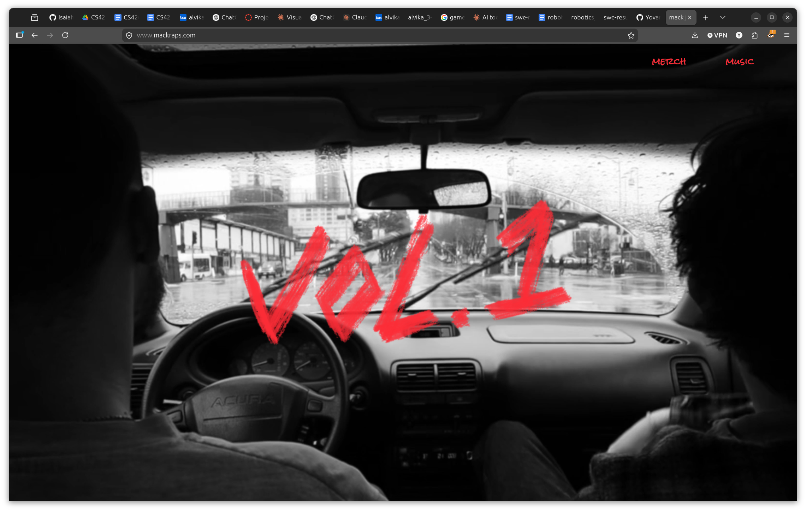
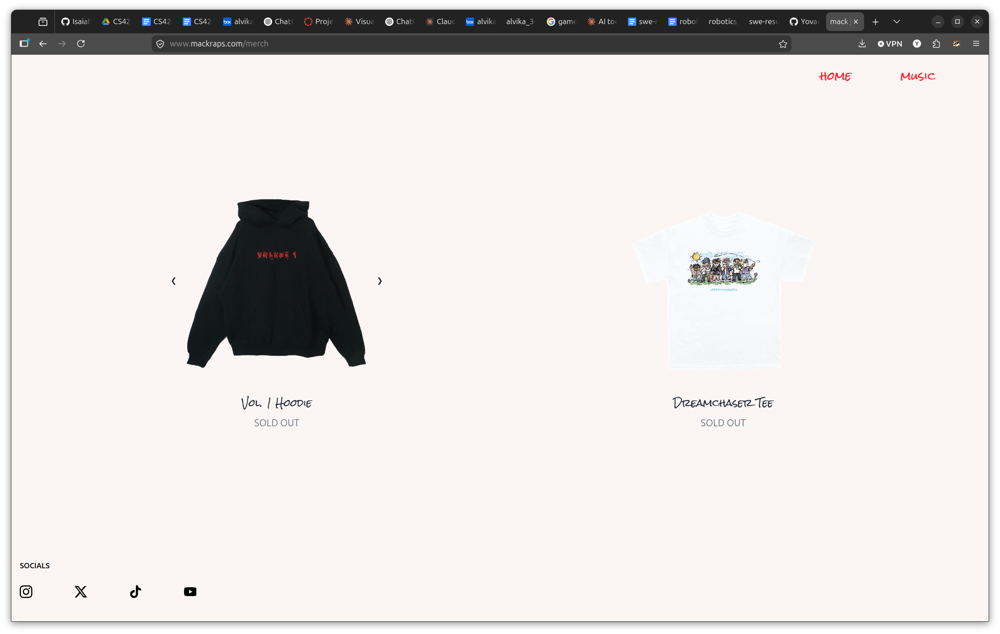
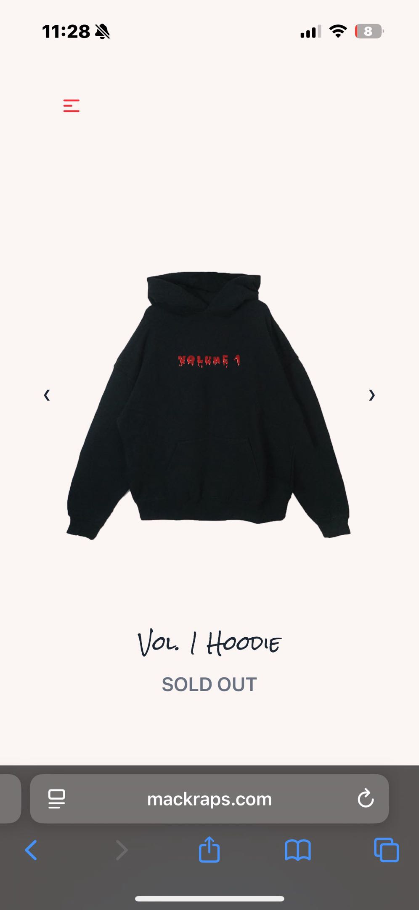

# Artist Merch Store

Production e-commerce store built for an independent music artist to sell branded merchandise. Live at [mackraps.com/merch](https://www.mackraps.com/merch).

## Screenshots

## Overview

Built and deployed a fully functional merch store handling real customer transactions. The store features product browsing, size selection, a persistent cart, and secure checkout, integrated directly into the artist's existing website.

## Tech Stack

- **Astro** — static site framework for fast page loads
- **React** — interactive product and cart components
- **Stripe Checkout** — hosted payment processing with webhook handling
- **Vercel** — deployment with environment-based configuration

## Features

- Product catalog with image carousels and size selection
- Cart state persisted via localStorage across page navigation
- Stripe Checkout integration with Stripe price IDs per variant
- Webhook endpoint for reliable payment event handling
- Responsive layout optimized for mobile and desktop
- Deployed to production with environment variable management for API keys

## Technical Decisions

**Cart with localStorage** — Used localStorage to persist cart state across the multi-page Astro site without requiring a backend or user authentication. Each cart item stores the Stripe price ID, product name, size, and quantity, making checkout handoff to Stripe straightforward.

**Stripe Hosted Checkout** — Chose Stripe's hosted checkout over a custom payment form to offload PCI compliance and reduce implementation risk for a client handling real transactions. Configured webhooks to verify payment completion server-side.

**Astro + React island architecture** — Used Astro for the static shell for performance, with React components hydrated only where interactivity was needed (product selector, cart).
